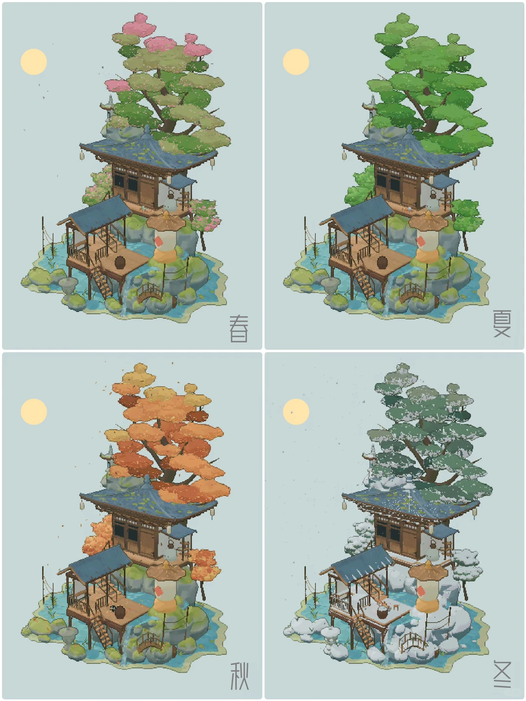
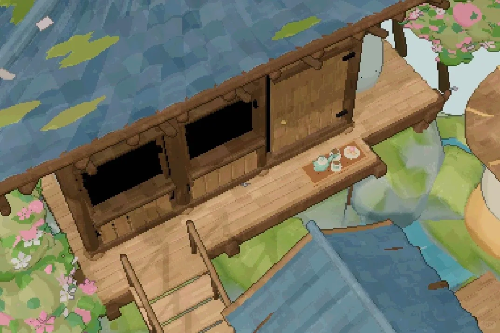
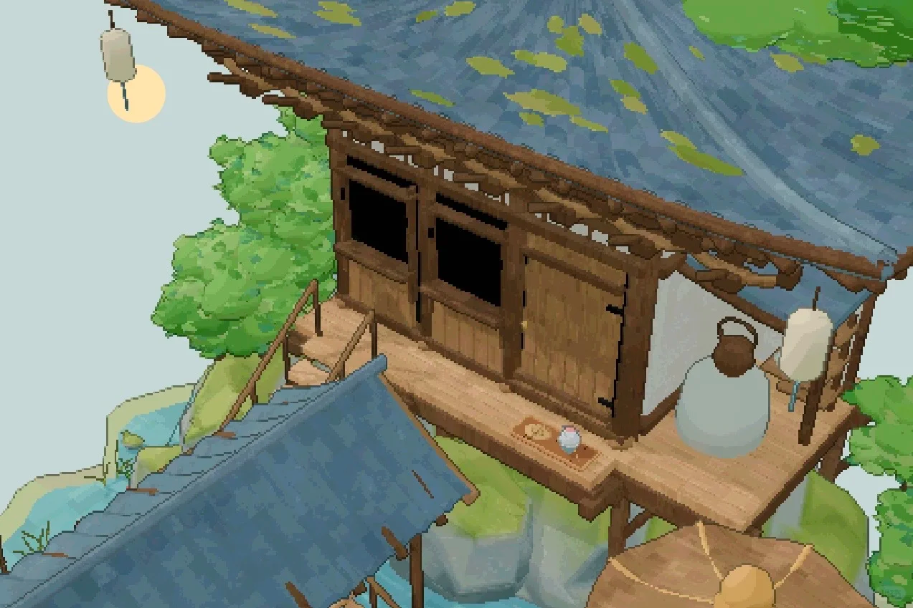
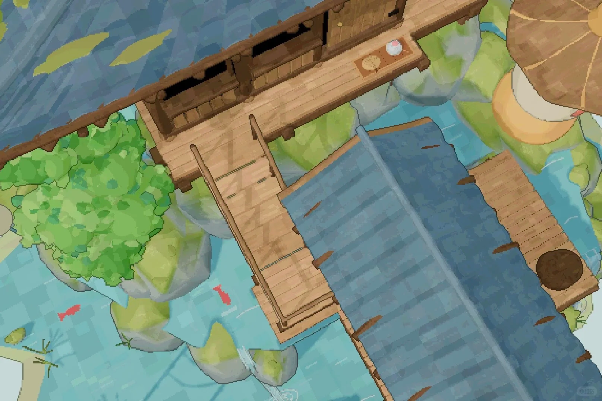
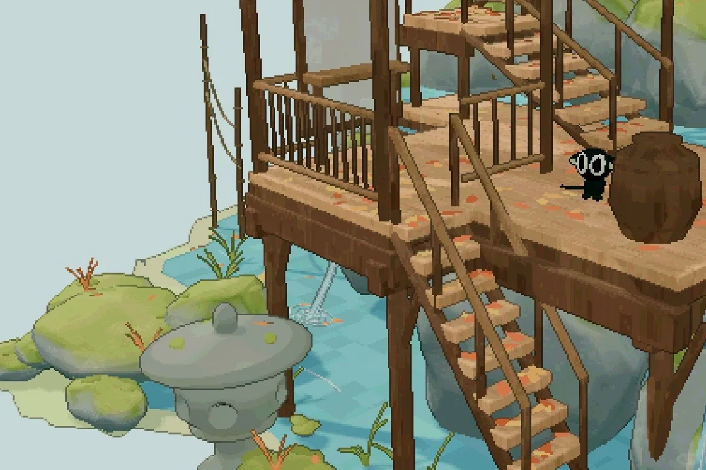
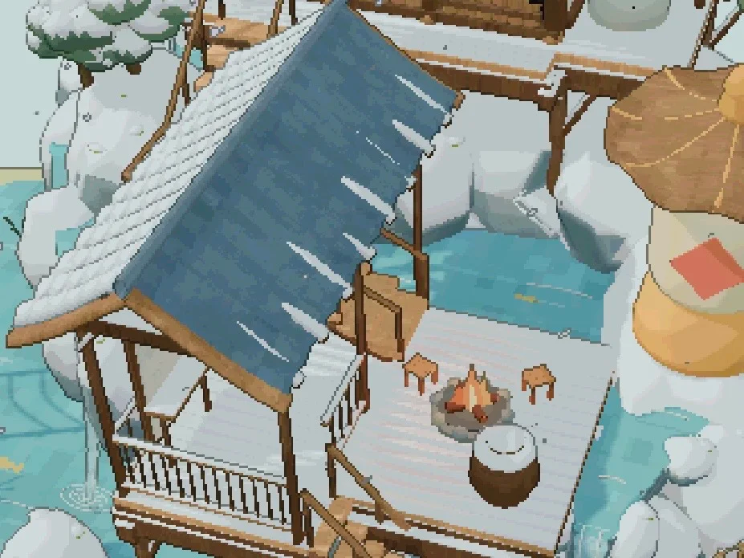
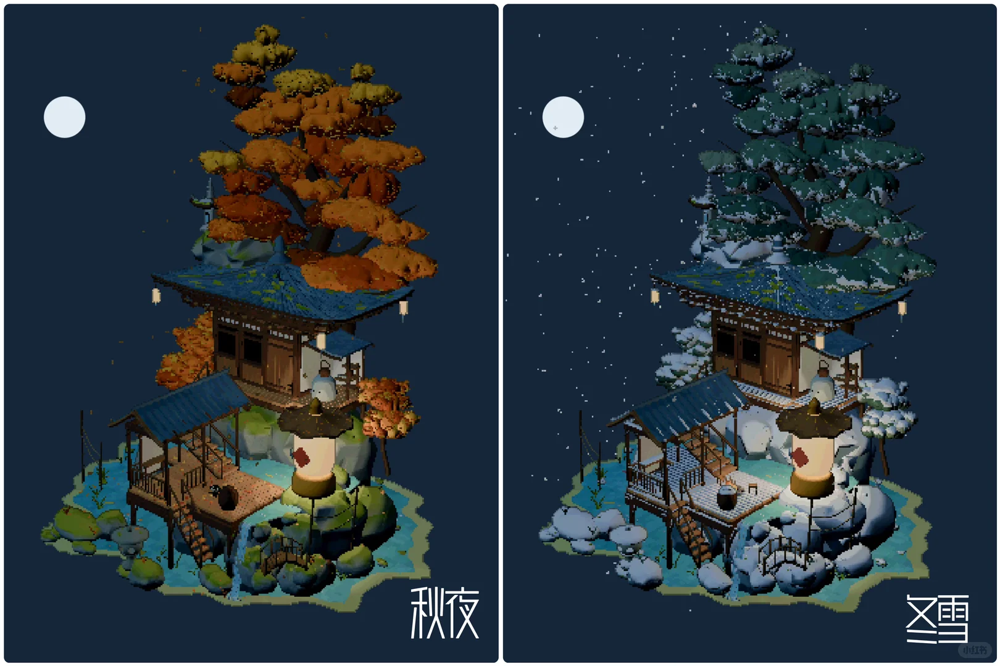
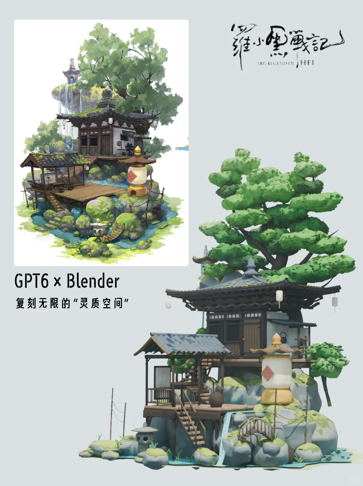

<div align="center">

# 《罗小黑战记》｜无限的「灵质空间」场景复刻

**AI 辅助 × Blender 场景搭建 / 四季变化 / 昼夜氛围 / 细节还原**

一个基于《罗小黑战记》中角色 **无限** 的「灵质空间」所制作的 3D 场景复刻项目。

</div>

---

## 项目简介

这个项目尝试把《罗小黑战记》中 **无限的灵质空间** 从二维画面重新搭建为可观察、可调整的 3D 场景。

制作过程中，我重点还原了场景里最有辨识度的结构与氛围，包括：

- 建在山石与水体之间的中式木构建筑
- 屋顶、回廊、木平台、楼梯与小桥
- 岩石、苔藓、水流、树木等自然环境
- 茶具、陶罐、石灯等生活化小物件
- 春、夏、秋、冬四季状态
- 秋夜、冬雪等不同时间与天气氛围

项目以 **AI 辅助分析 / 设计 + Blender 搭建与调整** 为主要方式，希望尽可能保留原作里那种安静、轻盈、与自然融为一体的“灵质空间”感觉。

---

## 场景总览

### 四季变化

<p align="center">
  
</p>

从同一套场景出发，通过调整树叶颜色、积雪、地表、水体与环境氛围，制作了春、夏、秋、冬四个版本。

---

## 场景细节

### 主屋与回廊

<p align="center">
  
  
</p>

木构建筑是整个场景的视觉中心。这里重点处理了屋檐、木门、回廊、栏杆，以及门前茶具、挂灯等小型陈设。

### 水体、桥与平台

<p align="center">
  
  
</p>

场景底部由岩石、水流、木平台和小桥连接。为了让空间不只是“建筑模型”，还加入了苔藓、浅水、植物、陶罐与石灯等细节，让整个环境更接近可以生活和停留的空间。

### 冬季细节

<p align="center">
  
</p>

冬季版本增加了屋顶、树木、岩石和平台上的积雪，同时保留水体与木结构的材质对比。

---

## 夜景与季节氛围

<p align="center">
  
</p>

除了白天的四季版本，也尝试了更偏氛围化的夜景表现。秋夜更强调暖色树叶和深色环境之间的层次；冬夜则加入雪景与冷色环境，让场景产生另一种安静感。

---

## 从参考到 3D 场景

<p align="center">
  
</p>

这个项目并不是对单张画面的机械复制，而是尝试把原作中的二维空间关系重新理解成一个完整的三维结构：建筑之间如何连接、平台如何落在岩石上、水流从哪里经过、树木怎样构成画面重心，以及从不同视角观察时场景是否仍然成立。

---

## 项目特点

- **完整 3D 化**：将原作中的场景关系重新组织为可以从不同角度观察的三维空间。
- **四季系统**：针对春、夏、秋、冬分别调整植被、积雪与整体氛围。
- **细节还原**：包含屋檐、回廊、楼梯、小桥、茶具、陶罐、石灯、水体与植物等元素。
- **风格化材质**：不追求写实，而是尽量保持原作轻松、柔和、动画化的视觉感受。
- **AI 辅助创作**：使用 AI 帮助进行场景理解、参考分析和创作探索，再在 Blender 中完成实际搭建与调整。

---

## 仓库内容

仓库中可以根据实际发布内容放置：

```text
.
├── README.md
├── assets/
│   └── images/              # README 展示图片
├── *.blend                  # Blender 工程文件（如有）
├── textures/                # 贴图资源（如有）
├── renders/                 # 渲染输出（如有）
└── ...
```

> 如果你的仓库目录和上面不同，直接按实际文件结构修改这一段即可。

---

## 使用方式

1. Clone 或下载本仓库。
2. 使用 Blender 打开仓库中的 `.blend` 工程文件。
3. 根据需要查看模型、材质、灯光、季节版本或重新进行渲染。

> Blender 版本、插件依赖和具体工程入口建议根据最终发布的项目文件补充在这里。

---

## 关于这个项目

这是一个出于学习、研究与个人创作兴趣制作的 **非官方同人场景复刻项目**，希望通过 AI 与 3D 工具探索动画场景从二维到三维的还原方式。

《罗小黑战记》相关角色、世界观、场景设定及视觉元素的版权归原作者及相关权利方所有。本仓库中的内容不代表官方立场，也不用于冒充官方作品。

如果你喜欢这个项目，欢迎给仓库一个 **Star**，也欢迎提交 Issue / PR 一起交流场景还原、Blender 与 AI 辅助创作。

---

<div align="center">

**Made with AI + Blender**

</div>
